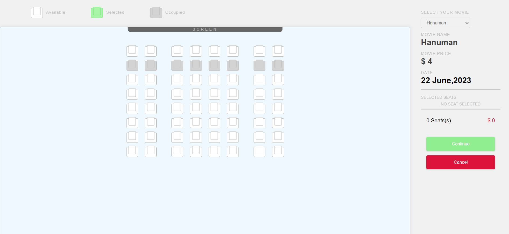

# Seat Booking App

This is a simple seat booking application built with HTML, CSS, and JavaScript.

## Overview

The Seat Booking App allows users to book seats for various events or venues. Users can view the available seats, select the desired ones, and proceed to book them. The application provides a simple and intuitive interface for users to interact with.

## Screenshots

## Features

- View available seats
- Select seats for booking
- Book selected seats
- View booking summary

## Installation

1. Clone the repository to your local machine:

    git clone https://github.com/SHIVanshuSingh07/seat-booking-app.git

2. Open `index.html` in your web browser to launch the application.

## Usage

1. Upon launching the application, you will be presented with the available seats layout.
2. Click on the seats you want to book.
3. Once you have selected your desired seats, click on the "Book Seats" button.
4. Review your booking summary and confirm your booking.

## Development

- `index.html` - Main HTML file containing the structure of the application.
- `style.css` - CSS file for styling the application.
- `script.js` - JavaScript file for implementing the functionality of the application.

## Contributing

Contributions are welcome! If you'd like to contribute to this project, please follow these steps:

1. Fork the repository.
2. Create your feature branch: `git checkout -b feature-name`.
3. Commit your changes: `git commit -am 'Add some feature'`.
4. Push to the branch: `git push origin feature-name`.
5. Submit a pull request.

